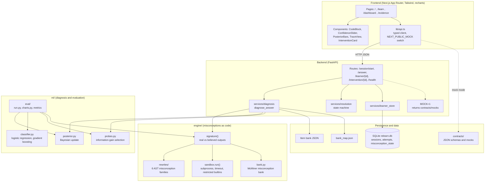
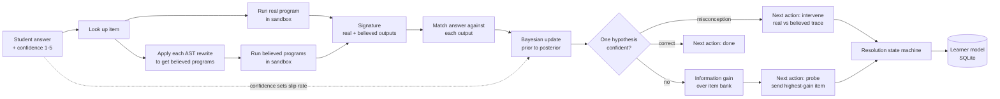
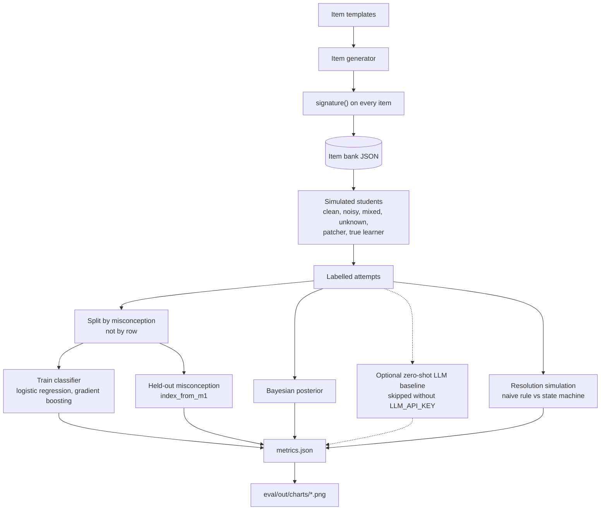
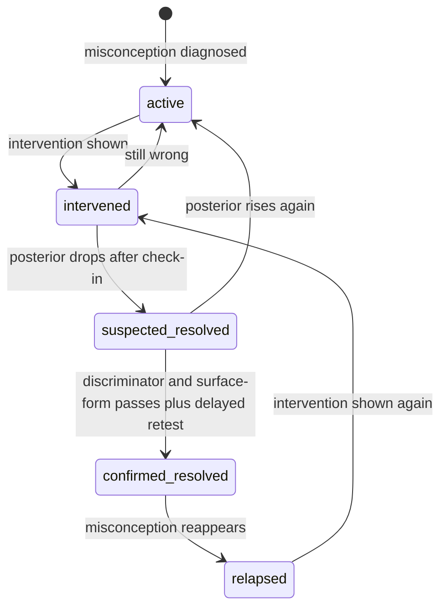

# Re:Learn

**Misconception-diagnosis tutor for introductory Python.**

Most tutors mark a wrong answer as wrong and treat a correct follow-up as proof of learning. Re:Learn does three things differently:

1. **Diagnoses the misconception, not the mistake.** Each misconception is an executable program rewrite (an AST transformation) of what the student believes Python does. A wrong answer becomes a hypothesis test: which believed program reproduces what the student said?
2. **Probes when the evidence is ambiguous.** If several misconceptions explain the same answer, it asks the question with the highest expected information gain.
3. **Verifies resolution instead of assuming it.** A misconception is only marked resolved after multiple discriminator and surface-form passes and a delayed retest. One correct answer cannot confirm resolution.

Built for BitNBuild (GDG CRCE), PS 3: *Re:Learn: Adaptive Multimodal Learning Environment*.

## Contents

- [Architecture](#architecture)
- [ML pipeline](#ml-pipeline)
- [Evaluation pipeline](#evaluation-pipeline)
- [Resolution state machine](#resolution-state-machine)
- [Requirements](#requirements)
- [First-time setup](#first-time-setup)
- [Run the real end-to-end demo](#run-the-real-end-to-end-demo)
- [Mock/demo mode](#mockdemo-mode)
- [Testing](#testing)
- [Evaluation and charts](#evaluation-and-charts)
- [API smoke checks](#api-smoke-checks)
- [Data and safety notes](#data-and-safety-notes)
- [Credits and license](#credits-and-license)

## Architecture



Dependency direction: `engine` ← `ml` ← `backend`. The frontend only talks to the backend over HTTP, using the JSON shapes in `contracts/`.

## ML pipeline

How one student answer becomes a diagnosis and a next action (`POST /answer`).



Key ideas:

- **Signature matching.** For a program `P` and misconception `M`, the believed program is `M(P)`. Running `P` and every `M(P)` gives the item's signature. The student's answer is matched against it.
- **Hypotheses** are the live misconception families plus `correct` and `unknown`. `unknown` absorbs answers that no interpreter predicts, so unseen misconceptions are flagged instead of confidently mislabelled.
- **Confidence matters.** A confident wrong answer is much less likely to be a slip, so it shifts probability toward a misconception.
- **Probing.** If the posterior is ambiguous, the next item is the one where the surviving hypotheses predict different outputs.

## Evaluation pipeline

Offline pipeline behind `python -m ml.eval.run --seed 42` and `python -m ml.eval.charts`.



## Resolution state machine



A correct answer on an item where the misconception and correct understanding give the same output is not counted as evidence.

## Requirements

- Python 3.11 or newer
- Node.js 20 or newer
- npm
- A writable checkout (the frontend build writes `.next/` and Next.js type files)

Run Python commands from the repository root so `PYTHONPATH=.` resolves the
`engine`, `ml`, and `backend` packages correctly.

## First-time setup

From the repository root:

```bash
python -m pip install -r requirements.txt
cd frontend
npm install
cd ..
```

PowerShell equivalents are available under `scripts/`:

```powershell
.\scripts\setup.ps1
```

If PowerShell blocks local scripts, run:

```powershell
Set-ExecutionPolicy -Scope Process Bypass
.\scripts\setup.ps1
```

## Run the real end-to-end demo

Use two terminals, both started from the repository root.

Terminal 1: backend with real diagnosis:

```bash
MOCK=0 python -m uvicorn backend.app.main:app --reload --port 8000
```

PowerShell:

```powershell
$env:MOCK = "0"
python -m uvicorn backend.app.main:app --reload --port 8000
```

Terminal 2: frontend connected to the backend:

```bash
cd frontend
NEXT_PUBLIC_API_BASE=http://localhost:8000 NEXT_PUBLIC_MOCK=0 npm run dev
```

PowerShell:

```powershell
cd frontend
$env:NEXT_PUBLIC_API_BASE = "http://localhost:8000"
$env:NEXT_PUBLIC_MOCK = "0"
npm run dev
```

Open [http://localhost:3000](http://localhost:3000), then use `/learn`.
Check the backend first with:

```bash
curl http://localhost:8000/health
```

Expected response:

```json
{"ok": true}
```

The live `/answer` response includes the posterior, top hypothesis, bank IDs,
real output, believed output/source, flat next-action fields, and the nested
`next` object.

## Mock/demo mode

Mock mode lets the frontend work without a live diagnosis session. Run the
backend in one terminal:

```bash
MOCK=1 python -m uvicorn backend.app.main:app --reload --port 8000
```

Then run the frontend with `NEXT_PUBLIC_MOCK=1`. The frontend reads the mock
contract responses from `contracts/mocks/`; it does not exercise the real ML
pipeline.

PowerShell:

```powershell
.\scripts\mock-backend.ps1
```

Use live mode for the final end-to-end diagnosis demo.

## Testing

Recommended focused validation from the repository root:

```bash
python -m pytest engine ml -q
python -m pytest backend/tests backend/app/services/tests -q
```

Current expected results are 158 engine/ML tests and 10 focused backend tests.

Frontend type-check:

```bash
cd frontend
npx tsc --noEmit --incremental false
cd ..
```

The repository also contains Make targets:

```bash
make setup
make test
make dev-backend
make dev-frontend
```

`make eval` is an older convenience target that uses seed `0`; use the
explicit seed-42 commands below for the reproducible demo report.

On Windows, prefer the matching scripts:

```powershell
.\scripts\test.ps1
.\scripts\dev-backend.ps1
.\scripts\dev-frontend.ps1
```

The full repository suite includes known unrelated collection/import checks.
Use the focused commands above when validating the demo path.

## Evaluation and charts

Run the deterministic evaluation and chart generation from the repository root:

```bash
python -m ml.eval.run --seed 42
python -m ml.eval.charts
```

Outputs are written to:

- `eval/out/metrics.json`
- `eval/out/charts/classifier_accuracy.png`
- `eval/out/charts/probe_overall.png`
- `eval/out/charts/probe_confusable.png`
- `eval/out/charts/false_resolution.png`
- `eval/out/charts/heldout_safety.png`
- `eval/out/charts/ablations.png`

The LLM baseline is optional. Without `LLM_API_KEY`, evaluation continues and
records the baseline as skipped.

The resolution state machine requires multiple discriminator/surface-form
passes and a delayed retest; one correct answer cannot confirm resolution.

## API smoke checks

Start a session:

```bash
curl -X POST http://localhost:8000/session/start
```

Submit the initial answer using the returned `session_id`:

```bash
curl -X POST http://localhost:8000/answer \
  -H "Content-Type: application/json" \
  -d '{"session_id":"SESSION_ID","item_id":"i1","answer":"10","confidence":5}'
```

For an intervention, use the returned misconception ID:

```bash
curl "http://localhost:8000/intervention/index_1_based?item_id=i1&session_id=SESSION_ID"
```

## Data and safety notes

- `index_from_m1` is held out and excluded from live diagnosis.
- Bank IDs are filtered against the loaded misconception bank. The invalid
  `noop_method` mapping entry `34` is not fabricated into live responses.
- SQLite data is stored in `relearn.db` by default. Set `RELEARN_DB_PATH` to
  use another database path for a clean demo session.
- No LLM key is required for the core pipeline.
- Student code runs in a subprocess with a timeout, restricted builtins, and an
  AST check that rejects imports and dunder attribute access. This is a
  prototype boundary, not a production sandbox.
- Authentication, production deployment, and persistent frontend session
  management are outside this hackathon skeleton.

Do not commit generated databases or environment secrets. Keep `LLM_API_KEY`
empty unless the optional baseline is intentionally being demonstrated.

## Credits and license

Misconception bank and problem set are from the McMiner repository
([taisazero/mcminer](https://github.com/taisazero/mcminer), MIT license),
released with:

> Al-Hossami, E. and Bunescu, R. *McMining: Automated Discovery of
> Misconceptions in Student Code.* EACL 2026 (Short Papers), pp. 160-178.
> https://aclanthology.org/2026.eacl-short.10/

The problem set draws on MBPP (CC BY 4.0), the Socratic Debugging dataset, the
Auckland dataset and handwritten problems. Re:Learn builds on the McMiner
misconception bank and adds disambiguating probes, targeted interventions,
verified resolution and a learner model.

Team: Aneesh (backend), Om (frontend), Sukhada (engine and data), Harshit (ML
and evaluation).
